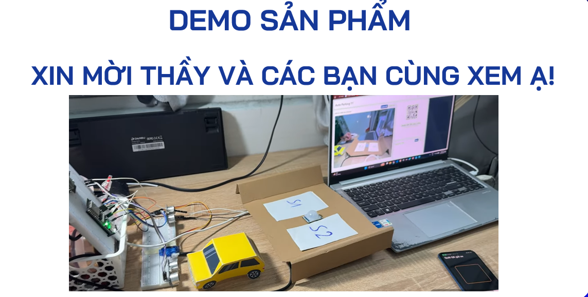
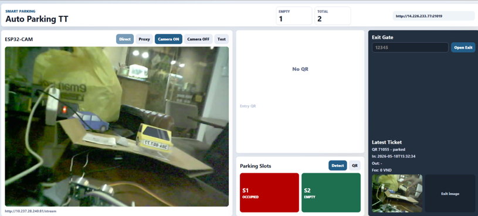
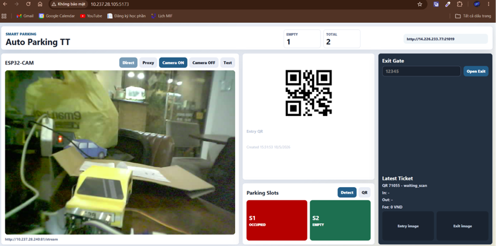
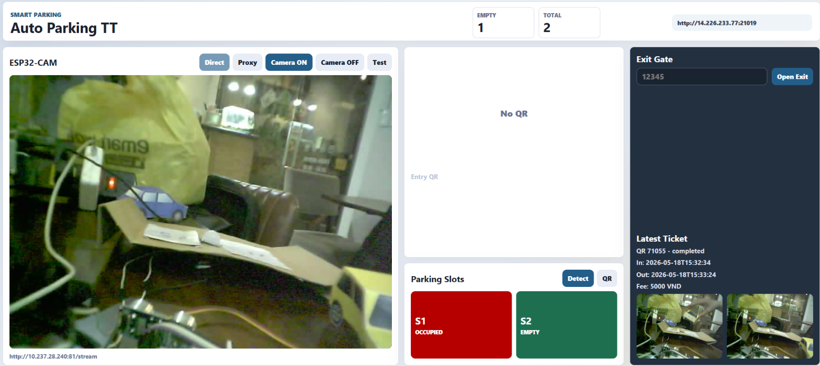

<h1 align="center"> IoT Automatic Parking System </h1>

<p align="center">
  <strong>Hệ thống bãi giữ xe tự động dùng ESP32, ESP32-CAM, FastAPI, React, Expo Mobile, QR Code, Telegram và AI nhận diện vị trí đỗ.</strong>
</p>

<p align="center">
  
  
  
  
  
</p>

## Tổng quan

Đây là dự án mô phỏng và triển khai một bãi giữ xe tự động. Khi xe đến cổng vào, cảm biến siêu âm trên ESP32 phát hiện xe, backend tạo mã QR mới và hiển thị lên web dashboard. Khách dùng app mobile để quét QR, hệ thống xác nhận vé, mở barrier và ghi nhận thời gian vào. Khi xe đi ra, người quản lý nhập mã vé 5 số trên dashboard, backend tính phí, lưu lịch sử và gửi thông báo kèm hình ảnh qua Telegram.

Dự án gồm 4 phần chính:

| Thành phần | Vai trò |
| --- | --- |
| `esp32_1` | Điều khiển cổng vào/ra, đọc cảm biến HC-SR04, điều khiển servo barrier, gọi API backend. |
| `esp32_cam` | Stream camera MJPEG, chụp ảnh xe, upload ảnh lên backend, báo khi PIR phát hiện chuyển động kết thúc. |
| `smart-parking/backend` | FastAPI server: tạo QR, quản lý vé, quản lý slot, nhận ảnh, tính phí, gửi Telegram, proxy camera. |
| `smart-parking/web` | Dashboard React/Vite cho người quản lý: xem camera, QR, slot trống, nhập mã ra, xem vé mới nhất. |
| `smart-parking/mobile` | App Expo React Native cho khách: quét QR, lưu vé, copy mã vé, báo lỗi. |

## Demo giao diện

<p align="center">
  
</p>

<details>
<summary>Xem thêm ảnh minh họa</summary>

### Sơ đồ hệ thống

<p align="center">
  
</p>

### Sơ đồ thiết bị

<p align="center">
  
</p>

### Dashboard web

<p align="center">
  
</p>

<p align="center">
  
</p>

<p align="center">
  
</p>

### App mobile và Telegram

<p align="center">
  
</p>

<p align="center">
  
</p>

</details>

## Tính năng nổi bật

- Tự phát hiện xe ở cổng vào bằng cảm biến siêu âm HC-SR04.
- Tạo mã QR vé gửi xe theo dạng `PARKING-xxxxx`.
- App mobile quét QR và xác nhận xe được phép vào bãi.
- Servo tự mở/đóng barrier theo trạng thái xe.
- Dashboard web theo dõi camera ESP32-CAM theo thời gian thực.
- Quản lý trạng thái vị trí đỗ: `empty` hoặc `occupied`.
- Hỗ trợ AI nhận diện xe bằng YOLO và cấu hình vùng slot bằng bounding box.
- Chụp ảnh xe lúc vào/ra, lưu vào backend và hiển thị trên dashboard.
- Tính phí tự động theo thời gian gửi xe, hiện tại là `5.000 VND/giờ`.
- Gửi thông báo Telegram khi xe vào, xe ra hoặc khách báo sự cố.
- Có API điều khiển camera, tạo QR, mở cổng, cập nhật slot và xử lý vé.

## Luồng hoạt động

### 1. Xe vào bãi

1. ESP32 cổng vào đọc khoảng cách từ HC-SR04.
2. Khi phát hiện xe, ESP32 gọi `POST /api/qr` để tạo vé QR.
3. Backend tạo mã 5 số, sinh ảnh QR và trả về thông tin vé.
4. Web dashboard tự refresh và hiển thị QR mới.
5. Khách mở app mobile, quét QR trên màn hình.
6. App gọi `POST /api/qr/scanned` để xác nhận vé.
7. Backend chuyển vé sang trạng thái `entered`, gửi lệnh `open_entry_gate`.
8. ESP32 đọc lệnh từ `GET /api/command`, mở barrier.
9. Khi xe đi qua cảm biến, ESP32 đóng barrier và gọi `POST /api/notify-entry/{qr_code}`.
10. Backend chụp/lấy ảnh từ ESP32-CAM, cập nhật vé và gửi Telegram.

### 2. Theo dõi chỗ trống

1. ESP32-CAM stream hình ảnh qua `http://ESP32_IP:81/stream`.
2. Dashboard có thể xem trực tiếp camera bằng chế độ Direct hoặc Proxy.
3. Khi PIR phát hiện xe đã di chuyển xong, ESP32-CAM upload ảnh lên backend.
4. Backend có thể chạy YOLO để phát hiện xe và so sánh với vùng slot cấu hình trong `slots.json`.
5. Dashboard hiển thị số slot trống và trạng thái từng slot.

### 3. Xe ra bãi

1. Cảm biến ở cổng ra phát hiện xe và gọi `POST /api/exit/detect`.
2. Dashboard hiển thị trạng thái chờ mã ra.
3. Người quản lý nhập mã vé 5 số.
4. Web gọi `POST /api/exit/by-qr`.
5. Backend kiểm tra vé, tính thời gian gửi, tính phí và lưu ảnh xe ra.
6. Backend đặt lệnh `open_exit_gate`, ESP32 mở barrier ra.
7. Khi xe đi qua, ESP32 đóng barrier và hệ thống quay lại trạng thái chờ.

## Kiến trúc thư mục

```text
IoT automatic parking system/
├── README.md
├── BaoCao.pptx
├── Hệ thống gửi xe tự động.docx
├── IMG/
│   ├── Demo.png
│   ├── Sơ Đồ Hệ Thống.png
│   ├── Sơ Đồ Thiết Bị.png
│   ├── web_Intro.png
│   ├── web_QR.png
│   ├── web_Exit.png
│   ├── giao diện app.png
│   └── Gửi thông tin về telegram.png
├── esp32_1/
│   └── esp32_1.ino
├── esp32_cam/
│   └── esp32_2.ino
└── smart-parking/
    ├── backend/
    │   ├── app/
    │   │   ├── main.py
    │   │   ├── store.py
    │   │   ├── config.py
    │   │   ├── schemas.py
    │   │   └── services/
    │   │       ├── fee.py
    │   │       ├── parking_ai.py
    │   │       ├── qr.py
    │   │       └── telegram.py
    │   ├── config/
    │   │   └── slots.example.json
    │   ├── model/
    │   │   └── yolo8.pt
    │   ├── uploads/
    │   ├── requirements.txt
    │   └── PARKING_AI_GUIDE.md
    ├── web/
    │   ├── pages/Dashboard.jsx
    │   ├── services/api.js
    │   ├── src/App.jsx
    │   └── package.json
    └── mobile/
        ├── App.js
        ├── app.json
        └── package.json
```

## Công nghệ sử dụng

| Nhóm | Công nghệ |
| --- | --- |
| Vi điều khiển | ESP32, ESP32-S3/ESP32-CAM, Arduino IDE |
| Cảm biến/thiết bị | HC-SR04, PIR, servo barrier |
| Backend | Python, FastAPI, Uvicorn, Pydantic |
| QR | `qrcode`, Pillow |
| Camera | MJPEG stream, upload JPEG |
| AI | OpenCV, Ultralytics YOLO |
| Web | React, Vite, CSS |
| Mobile | Expo, React Native, `expo-camera`, `expo-clipboard` |
| Thông báo | Telegram Bot API |

## Yêu cầu môi trường

- Python 3.11 trở lên.
- Node.js và npm.
- Arduino IDE hoặc PlatformIO.
- Board ESP32 cho barrier.
- Board ESP32-CAM/ESP32-S3 camera đúng với chân đã khai báo trong `esp32_cam/esp32_2.ino`.
- Cùng mạng LAN cho máy chạy backend, ESP32 và điện thoại chạy app mobile.
- Telegram bot token và chat id nếu muốn dùng thông báo Telegram.

## Cài đặt backend

Mở terminal tại thư mục gốc dự án, sau đó chạy:

```powershell
cd smart-parking\backend
python -m venv .venv
.\.venv\Scripts\Activate.ps1
pip install -r requirements.txt
copy .env.example .env
```

Mở file `.env` và sửa theo mạng của bạn:

```env
ESP32_CAM_STREAM_URL=http://ESP32_CAM_IP:81/stream
PUBLIC_BASE_URL=http://BACKEND_IP:8000
TELEGRAM_BOT_TOKEN=your_telegram_bot_token
TELEGRAM_CHAT_ID=your_telegram_chat_id
YOLO_MODEL_PATH=model/yolo8.pt
YOLO_SLOT_CONFIG=config/slots.json
```

Chạy backend:

```powershell
python -m uvicorn app.main:app --host 0.0.0.0 --port 8000 --reload
```

Kiểm tra API:

```text
http://localhost:8000/
http://localhost:8000/api/status
http://localhost:8000/docs
```

## Cài đặt web dashboard

```powershell
cd smart-parking\web
npm install
npm run dev -- --host 0.0.0.0
```

Mặc định web sẽ gọi backend tại:

```text
http://<hostname-cua-trinh-duyet>:8000
```

Nếu muốn cấu hình thủ công:

```powershell
$env:VITE_API_URL="http://localhost:8000"
$env:VITE_CAMERA_STREAM_URL="http://ESP32_CAM_IP:81/stream"
npm run dev -- --host 0.0.0.0
```

Sau khi chạy, mở URL Vite in ra terminal, thường là:

```text
http://localhost:5173
```

## Cài đặt app mobile

```powershell
cd smart-parking\mobile
npm install
npm start
```

Sau đó:

1. Cài Expo Go trên điện thoại.
2. Đảm bảo điện thoại và máy chạy backend cùng mạng.
3. Quét QR Expo trong terminal.
4. Cấp quyền camera cho app.

App mobile đọc API từ biến môi trường `EXPO_PUBLIC_API_URL`. Nếu không cấu hình, app dùng giá trị mẫu `http://BACKEND_IP:8000`.

Khi chạy local, đặt IP máy đang chạy backend, ví dụ:

```powershell
$env:EXPO_PUBLIC_API_URL="http://192.168.1.10:8000"
npm start
```

## Nạp code ESP32

### ESP32 điều khiển barrier

File:

```text
esp32_1/esp32_1.ino
```

Chức năng:

- Kết nối WiFi.
- Đọc cảm biến HC-SR04 ở cổng vào và cổng ra.
- Gọi backend để tạo QR khi có xe vào.
- Kiểm tra QR đã được quét hay chưa.
- Điều khiển servo mở/đóng barrier.
- Gửi sự kiện xe vào/ra cho backend.

Trước khi nạp code, sửa:

```cpp
const char* ssid = "YOUR_WIFI";
const char* password = "YOUR_PASSWORD";
const char* serverUrl = "http://BACKEND_IP:8000";
```

Kiểm tra lại chân phần cứng:

```cpp
#define TRIG_PIN 35
#define ECHO_PIN 36
#define EXIT_ECHO_PIN 37
#define EXIT_TRIG_PIN 38
#define SERVO_PIN 21
```

Thư viện cần có:

- `WiFi`
- `HTTPClient`
- `ESP32Servo`

### ESP32-CAM

File:

```text
esp32_cam/esp32_2.ino
```

Chức năng:

- Kết nối WiFi.
- Khởi tạo camera.
- Mở server stream MJPEG tại `http://ESP32_CAM_IP:81/stream`.
- Mở endpoint chụp ảnh tĩnh tại `http://ESP32_CAM_IP:81/capture`.
- Poll lệnh từ backend: `capture_image`, `camera_on`, `camera_off`.
- Upload ảnh JPEG lên `POST /api/upload`.
- Dùng PIR để báo backend khi chuyển động trong bãi kết thúc.

Trước khi nạp code, sửa:

```cpp
const char* ssid = "YOUR_WIFI";
const char* password = "YOUR_PASSWORD";
const char* serverUrl = "http://BACKEND_IP:8000";
```

Kiểm tra lại chân camera và PIR trong file, vì mỗi board ESP32-CAM có sơ đồ chân khác nhau.

Thư viện cần có:

- `esp_camera`
- `WiFi`
- `HTTPClient`
- `ArduinoJson`
- `WebServer`

## Cấu hình AI nhận diện slot

Backend có thể nhận diện slot trống bằng YOLO. Logic nằm trong:

```text
smart-parking/backend/app/services/parking_ai.py
```

Cách hoạt động:

1. ESP32-CAM chụp ảnh bãi xe.
2. YOLO phát hiện các phương tiện trong ảnh.
3. Backend đọc tọa độ slot từ file JSON.
4. Nếu bounding box xe giao với vùng slot đủ lớn, slot đó được đánh dấu `occupied`.
5. Slot không có xe được đánh dấu `empty`.

Tạo file cấu hình từ mẫu:

```powershell
cd smart-parking\backend
copy config\slots.example.json config\slots.json
```

Ví dụ `slots.json`:

```json
{
  "slots": [
    { "slot_id": "S1", "bbox": [120, 180, 310, 420] },
    { "slot_id": "S2", "bbox": [330, 180, 520, 420] }
  ]
}
```

Trong đó `bbox` là:

```text
[x1, y1, x2, y2]
```

Chi tiết hơn xem file:

```text
smart-parking/backend/PARKING_AI_GUIDE.md
```

## API chính

| Method | Endpoint | Mục đích |
| --- | --- | --- |
| `GET` | `/api/status` | Lấy trạng thái tổng quan hệ thống. |
| `GET` | `/api/command` | ESP32 đọc lệnh hiện tại từ backend. |
| `POST` | `/api/reset` | Đưa lệnh về `idle`. |
| `POST` | `/api/qr` | Tạo QR mới hoặc xóa QR hiện tại. |
| `GET` | `/api/qr/latest` | Lấy QR đang hiển thị trên dashboard. |
| `POST` | `/api/qr/scanned` | App mobile gửi QR đã quét. |
| `GET` | `/api/qr/scanned/latest` | ESP32 kiểm tra QR mới quét. |
| `POST` | `/api/notify-entry/{qr_code}` | Báo xe đã vào, lưu ảnh và gửi Telegram. |
| `GET` | `/api/slots` | Lấy trạng thái các slot. |
| `POST` | `/api/slots/update` | Cập nhật slot thủ công. |
| `POST` | `/api/slots/detect` | Chụp ảnh và nhận diện slot bằng AI. |
| `POST` | `/api/upload` | ESP32-CAM upload ảnh JPEG. |
| `GET` | `/api/camera/stream` | Backend proxy stream ESP32-CAM. |
| `POST` | `/api/exit/detect` | Báo có xe đang chờ ra. |
| `POST` | `/api/exit/by-qr` | Xử lý xe ra bằng mã QR. |
| `GET` | `/api/tickets` | Lấy danh sách vé. |
| `POST` | `/api/report-issue` | App mobile báo sự cố lên Telegram. |

## Trạng thái vé

| Trạng thái | Ý nghĩa |
| --- | --- |
| `waiting_scan` | Backend đã tạo QR, đang chờ khách quét. |
| `entered` | QR hợp lệ, xe được phép vào. |
| `parked` | Xe đã qua cổng vào và đang trong bãi. |
| `exiting` | Xe đang trong quá trình ra. |
| `completed` | Xe đã ra, vé đã hoàn tất. |

## Lệnh điều khiển ESP32

Backend lưu một lệnh hiện tại trong `store.current_command`. ESP32 định kỳ gọi `/api/command` để đọc lệnh:

| Lệnh | Thiết bị xử lý | Ý nghĩa |
| --- | --- | --- |
| `idle` | Tất cả | Không có lệnh mới. |
| `open_entry_gate` | ESP32 barrier | Mở cổng vào. |
| `open_exit_gate` | ESP32 barrier | Mở cổng ra. |
| `wait_exit_code` | Dashboard/ESP32 | Có xe ở cổng ra, chờ nhập mã. |
| `capture_image` | ESP32-CAM | Chụp và upload ảnh. |
| `camera_on` | ESP32-CAM | Bật camera/stream. |
| `camera_off` | ESP32-CAM | Tắt camera. |

## Telegram bot

Backend hỗ trợ gửi tin nhắn và ảnh qua Telegram. Các sự kiện đang dùng:

- Xe vào bãi.
- Xe ra bãi.
- Khách báo lỗi từ app mobile.
- Lệnh điều khiển qua Telegram: `/qr`, `/open_entry`, `/open_exit`, `/status`.

Cấu hình trong `.env`:

```env
TELEGRAM_BOT_TOKEN=your_telegram_bot_token
TELEGRAM_CHAT_ID=your_telegram_chat_id
```

Kiểm tra Telegram đã cấu hình chưa:

```text
http://localhost:8000/api/telegram/status
```

## Lưu ý bảo mật trước khi public GitHub

- Không commit token Telegram thật.
- Không commit mật khẩu WiFi thật trong file `.ino`.
- Không commit file `.env`.
- Không nên commit `node_modules`, `.venv`, `__pycache__`, ảnh upload runtime hoặc model dung lượng lớn nếu không cần.
- Nếu token đã từng bị public, hãy thu hồi token cũ và tạo token mới.

## Một số lỗi thường gặp

### Web không gọi được backend

- Kiểm tra backend có chạy ở port `8000` chưa.
- Mở `http://localhost:8000/api/status` để kiểm tra.
- Nếu dùng điện thoại hoặc máy khác trong LAN, dùng IP LAN thay vì `localhost`.
- Kiểm tra firewall Windows có chặn Python/Uvicorn không.

### Dashboard không thấy camera

- Mở trực tiếp `http://ESP32_CAM_IP:81/stream` trên trình duyệt.
- Kiểm tra `ESP32_CAM_STREAM_URL` trong `.env`.
- Thử chế độ Proxy trên dashboard.
- Đảm bảo ESP32-CAM và máy backend cùng mạng.

### App mobile quét QR nhưng báo lỗi server

- Kiểm tra `API_BASE_URL` trong `smart-parking/mobile/App.js`.
- Không dùng `localhost` trên điện thoại, hãy dùng IP LAN của máy backend.
- Đảm bảo backend cho phép truy cập trong cùng mạng.

### QR đã quét nhưng cổng không mở

- Kiểm tra ESP32 barrier có gọi được `/api/command` không.
- Mở Serial Monitor để xem lệnh hiện tại.
- Kiểm tra `serverUrl` trong `esp32_1.ino`.
- Kiểm tra backend có trả `open_entry_gate` sau khi app gọi `/api/qr/scanned` không.

### Nhận diện slot sai

- Kiểm tra ảnh ESP32-CAM có đúng góc và đúng độ phân giải lúc lấy tọa độ không.
- Sửa `config/slots.json` cho đúng vùng từng slot.
- Xem thêm `smart-parking/backend/PARKING_AI_GUIDE.md` để chỉnh ngưỡng YOLO.

## Gợi ý phát triển tiếp

- Lưu vé vào database thay vì lưu in-memory.
- Thêm đăng nhập cho dashboard quản trị.
- Tách API URL mobile ra file cấu hình/env.
- Tự động in hóa đơn hoặc xuất báo cáo doanh thu.
- Thêm thanh toán QR chuyển khoản.
- Thêm nhận diện biển số xe.
- Tạo `.gitignore` chuẩn cho Python, Node.js, Arduino và file runtime.

## Tác giả

Dự án phục vụ học tập và demo hệ thống IoT bãi giữ xe tự động.

Repository: `IoT-Automatic-Parking-System`
